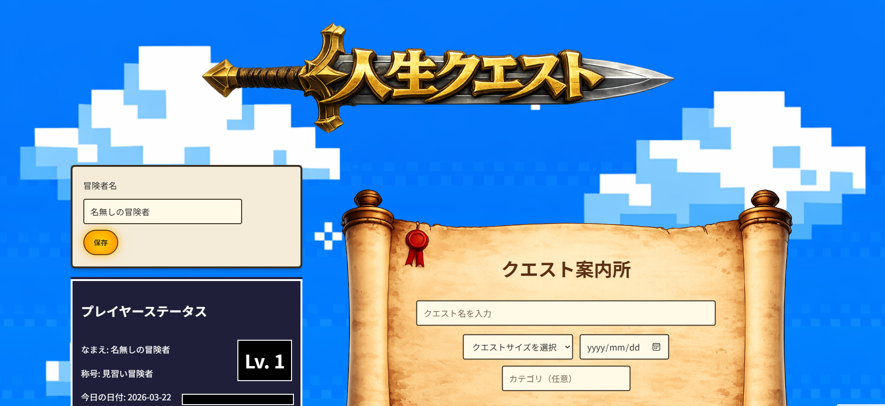
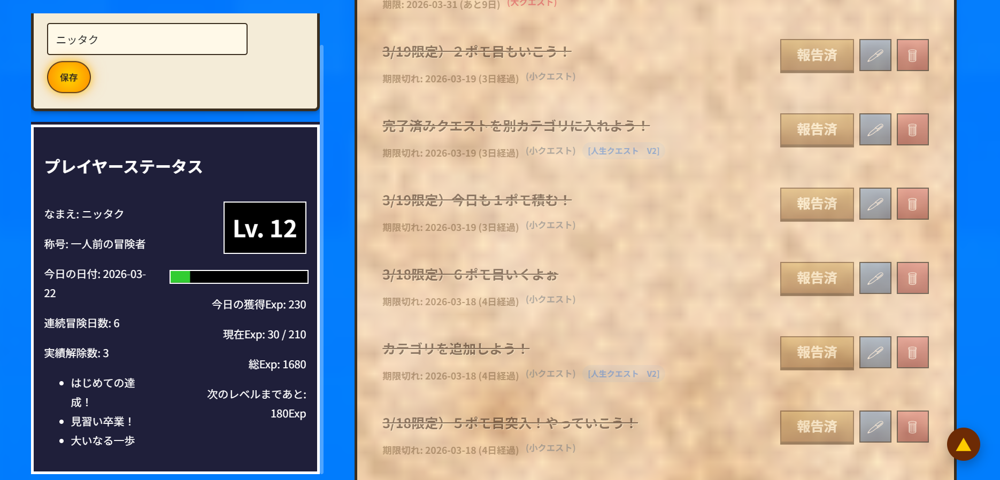

# 人生クエスト V5

## スクリーンショット

日々のタスクを「クエスト」として管理し、
ゲーム感覚で継続できるよう設計したWebアプリです。

「続かない」を「自然に続く」に変えることを目的に、
UI/UXを重視して設計しています。

主に「タスク管理が続かない人」を対象に設計しています。

V3ではUI・UXの改善に重点を置き、 
「今日やるべきことが自然に目に入る設計」を意識して改良しました。

V4では初回ユーザーの体験に注力し、 
ガイド機能やヘルプモーダルを導入することで、 
「迷わず始められる導線設計」を実装しました。

V5では操作の操作のわかりやすさをさらに強化し、 
カテゴリ管理の構造整理やUIの余白・配置を見直すことで、 
「自然に使える・迷わない操作体験」へと改良しています。

## デモ
https://taxintian-cloud.github.io/Jinsei-Quest-V1andV2/

## 主な機能

- クエスト追加・削除・完了管理
- クエストサイズ（小・中・大）による経験値変動
- 期限設定と残り日数表示
- カテゴリ管理・フィルター機能
- プレイヤーステータス表示（レベル・経験値）

## V3での改善

- 「今日のクエスト」を視覚的に強調（背景・発光）
- 期限が当日のタスクを強調表示
- プレイヤーステータスのUI改善（カード化・余白調整）
- stickyによるステータス固定表示
- レスポンシブ対応の最適化（スマホ時のレイアウト再設計）

## V4での改善
- ヘルプモーダル（「？」ボタン）を実装
- 初回アクセス時にガイドを自動表示（オンボーディング）
- クエストサイズ・カテゴリの説明を追加
-「最初のクエストを作る」ボタンで行動導線を設計
- モーダル内スクロール対応
- iPhone SafariのUI被り対策（safe-area対応）
- スマホUIの再設計（背景レイアウト→カード型へ変更）

## V5での改善（New!）
UI改善（カテゴリ管理の構造整理とUX向上）

・クエスト案内所UIの強化
→ 視認性・操作性を意識したレイアウトに改善

・カテゴリ管理UIの改善
→ 追加・フィルター機能を整理し、使いやすさを向上

・入力フォームのUX改善
→ 日付入力や操作導線を自然に改善

・装飾・世界観の強化
→ ギルド風UI、装飾フレームを実装し没入感を向上

・ボタン・操作フィードバックの改善
→ 押したくなるUI、視覚的な変化を強化

今回のポイント

本バージョンでは
「機能」ではなく「体験」を重視して設計しています。

単に使えるだけでなく、
「使いたくなる」UIを目指しました。

## 更新履歴
- Lv.15：カテゴリ管理UI改善

## 工夫した点

- 「目立たせる」ではなく「自然に行動したくなるUI」を意識
- 情報（テキスト）とUI（数値・ゲージ）の配置を分離
- レスポンシブ時はレイアウト構造自体を変更
- ユーザーが迷わないよう視線誘導を設計

## 使用技術

- HTML / CSS / JavaScript（Vanilla JS）

## 開発中（進行中）

- クエストのUX改善（操作フローの最適化）

## 今後の改善

- データ保存の拡張（localStorage ⇒ DB化）
- UXのさらなる強化（演出・フィードバック）

## 検討中 / アイデア

- 初回クエストの自動提案機能

## お問い合わせについて

- UI/UX改善やWeb制作のご相談も対応可能です。
- お気軽にご連絡ください。
